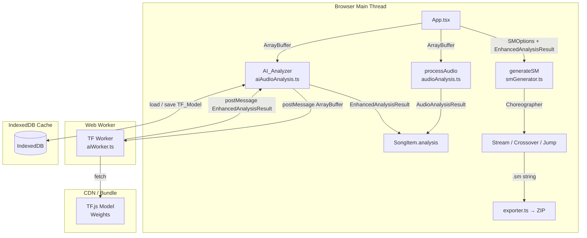

# Document de Design — Chorégraphe IA & Modèles d'Apprentissage (Phase 2)

## Vue d'ensemble

Cette phase augmente StepSync en deux axes complémentaires :

1. **AI_Analyzer** (`src/lib/aiAudioAnalysis.ts`) : module de séparation de sources audio côté client via TensorFlow.js, produisant un `Source_Profile` (kick, snare, basse, lead) et détectant les sections `Drop`.
2. **Choreographer** (extension de `src/lib/smGenerator.ts`) : trois algorithmes de placement de notes — *Stream*, *Crossover/Tech* et *Jump* — qui consomment le `Source_Profile` pour produire des stepcharts stylistiquement distincts et jouables.

L'intégration est **non-régressive** : le pipeline existant (filtre lowpass + placement probabiliste) reste le comportement par défaut lorsqu'aucun `Source_Profile` n'est disponible.

---

## Architecture

### Vue d'ensemble des flux



### Principes architecturaux

- **Isolation du thread principal** : toute l'inférence TensorFlow.js s'exécute dans un `Web Worker` dédié (`src/lib/aiWorker.ts`). Le thread principal ne reçoit que les résultats sérialisés.
- **Import dynamique** : `aiAudioAnalysis.ts` est chargé via `import()` dynamique pour ne pas augmenter le bundle initial de plus de 50 Ko (hors poids du modèle TF.js).
- **Fallback transparent** : si TF.js échoue (réseau, WebGL/WASM absent, modèle corrompu), `AI_Analyzer` expose `fallback: true` et l'application continue avec `processAudio` existant.
- **Rétrocompatibilité** : `EnhancedAnalysisResult` étend `AudioAnalysisResult` sans modifier aucun champ existant. `generateSM` accepte les deux types.

---

## Composants et Interfaces

### 1. `src/lib/aiAudioAnalysis.ts` — AI_Analyzer

Module principal côté client. Orchestre le chargement du modèle, la communication avec le Worker et l'exposition de l'état réactif.

```typescript
// État observable exposé aux composants React
export interface AIAnalyzerState {
  status: 'idle' | 'loading' | 'ready' | 'analyzing' | 'error';
  fallback: boolean;
  progress: number; // 0–100 pendant l'analyse
  error?: string;
}

// Fonction principale d'analyse
export async function analyzeAudio(
  arrayBuffer: ArrayBuffer,
  onProgress?: (pct: number) => void,
  signal?: AbortSignal
): Promise<EnhancedAnalysisResult>

// Initialisation du modèle (appelée au démarrage de l'app)
export async function initAIAnalyzer(): Promise<void>

// Libération des ressources
export async function disposeAIAnalyzer(): Promise<void>
```

**Décision de design** : l'état `AIAnalyzerState` est exposé via un `EventEmitter` léger (ou un simple callback) plutôt qu'un store global, pour rester découplé de React. Les composants s'y abonnent via un hook `useAIAnalyzer()`.

### 2. `src/lib/aiWorker.ts` — Web Worker TF.js

Exécuté dans un contexte Worker isolé. Reçoit des `ArrayBuffer` audio, exécute l'inférence TF.js et renvoie les résultats.

```typescript
// Messages entrants (Main → Worker)
type WorkerInMessage =
  | { type: 'INIT'; modelUrl: string }
  | { type: 'ANALYZE'; id: string; buffer: ArrayBuffer; sampleRate: number }
  | { type: 'ABORT'; id: string }
  | { type: 'DISPOSE' }

// Messages sortants (Worker → Main)
type WorkerOutMessage =
  | { type: 'INIT_OK' }
  | { type: 'INIT_FALLBACK'; reason: string }
  | { type: 'PROGRESS'; id: string; pct: number }
  | { type: 'RESULT'; id: string; result: EnhancedAnalysisResult }
  | { type: 'ERROR'; id: string; message: string }
```

**Décision de design** : le Worker est instancié une seule fois et réutilisé entre les fichiers (Exigence 9.5). Le transfert de l'`ArrayBuffer` utilise `Transferable` pour éviter la copie mémoire.

### 3. `src/lib/aiModelCache.ts` — Cache IndexedDB

Gère la persistance du modèle TF.js entre les sessions.

```typescript
export async function saveModelToCache(modelUrl: string, artifacts: tf.io.ModelArtifacts): Promise<void>
export async function loadModelFromCache(modelUrl: string): Promise<tf.io.ModelArtifacts | null>
export async function clearModelCache(): Promise<void>
```

### 4. Extension de `src/lib/smGenerator.ts` — Choreographer

Le `Choreographer` est un sous-système interne de `generateSM`. Il est activé uniquement si `EnhancedAnalysisResult` est fourni et qu'un `choreographyStyle` est spécifié.

```typescript
// Ajout à SMOptions
export interface SMOptions {
  // ... champs existants inchangés ...
  choreographyStyle?: ChoreographyStyle; // nouveau champ optionnel
}

export type ChoreographyStyle = 'stream' | 'crossover' | 'jump';

// Interface interne du Choreographer
interface ChoreographerContext {
  style: ChoreographyStyle;
  sourceProfile: SourceProfile;
  drops: DropInterval[];
  numPanels: number;
  difficulty: DifficultyConfig;
  tempoMap: TempoMap; // classe existante
}

function buildChoreography(ctx: ChoreographerContext): Map<number, string>
// Retourne une Map<beatIndex, stepLine> pour chaque beat
```

### 5. Extension de `src/components/steps/AlgorithmStep.tsx`

Ajout du sélecteur de style chorégraphique et de l'indicateur d'état IA.

```typescript
interface AlgorithmStepProps {
  // ... props existantes inchangées ...
  choreographyStyle: ChoreographyStyle | null;
  setChoreographyStyle: (style: ChoreographyStyle | null) => void;
  aiStatus: AIAnalyzerState['status'];
  aiFallback: boolean;
  aiProgress: number;
}
```

### 6. Hook `src/hooks/useAIAnalyzer.ts`

```typescript
export function useAIAnalyzer(): {
  state: AIAnalyzerState;
  analyzeAudio: (buffer: ArrayBuffer, signal?: AbortSignal) => Promise<EnhancedAnalysisResult>;
}
```

---

## Modèles de Données

### `EnhancedAnalysisResult`

Étend `AudioAnalysisResult` sans modifier aucun champ existant.

```typescript
import { AudioAnalysisResult } from './audioAnalysis';

export interface SourceProfile {
  kick:  number[]; // énergie normalisée [0.0–1.0], 100 échantillons/seconde
  snare: number[]; // même résolution
  bass:  number[]; // même résolution
  lead:  number[]; // même résolution
}

export interface DropInterval {
  startTime: number; // secondes
  endTime:   number; // secondes
}

export interface OnsetEvent {
  timeInSeconds: number;
  energy:        number; // [0.0–1.0]
  source:        'kick' | 'snare' | 'bass' | 'lead';
}

export interface EnhancedAnalysisResult extends AudioAnalysisResult {
  sourceProfile: SourceProfile;
  drops:         DropInterval[];
  onsets:        OnsetEvent[];   // liste triée par timeInSeconds
  aiVersion:     string;         // ex. "1.0.0" pour traçabilité
}
```

**Décision de design** : les `onsets` sont pré-calculés dans le Worker pour éviter de répéter la détection de transitoires dans le Choreographer. La résolution temporelle cible est < 10 ms (Exigence 2.4).

### `ChoreographyStyle` (énumération)

```typescript
export type ChoreographyStyle = 'stream' | 'crossover' | 'jump';
```

### Extension de `SongItem`

```typescript
export interface SongItem {
  // ... champs existants inchangés ...
  enhancedAnalysis?: EnhancedAnalysisResult; // nouveau champ optionnel
  choreographyStyle?: ChoreographyStyle;     // nouveau champ optionnel
}
```

### Extension de `SMOptions`

```typescript
export interface SMOptions {
  // ... tous les champs existants inchangés ...
  choreographyStyle?: ChoreographyStyle;
}
```

### Modèle TF.js — Stratégie de sélection

**Décision de design** : plutôt que d'entraîner un modèle de séparation de sources complet (type Demucs, trop lourd pour le navigateur), nous utilisons une approche hybride :

1. **Filtres adaptatifs par bande** : le Worker applique des filtres passe-bande (kick : 60–200 Hz, snare : 200–8000 Hz avec accent sur les transitoires, basse : 40–300 Hz, lead : 1000–16000 Hz) via `OfflineAudioContext`.
2. **Modèle TF.js léger de classification d'onsets** : un petit CNN (< 2 Mo de poids) entraîné sur des spectrogrammes mel pour distinguer kick/snare/autre avec une précision temporelle < 10 ms. Ce modèle est chargé depuis un CDN ou bundlé localement.
3. **Profils d'énergie** : calculés à partir des signaux filtrés, normalisés entre 0.0 et 1.0.

Cette approche garantit :
- Un bundle initial < 50 Ko (hors poids TF.js, chargés en différé).
- Une consommation mémoire < 512 Mo (traitement par segments de 2 s).
- Une initialisation < 3 s sur matériel de milieu de gamme.

---

## Propriétés de Correction

*Une propriété est une caractéristique ou un comportement qui doit être vrai pour toutes les exécutions valides d'un système — essentiellement, un énoncé formel de ce que le système doit faire. Les propriétés servent de pont entre les spécifications lisibles par l'humain et les garanties de correction vérifiables par machine.*

### Propriété 1 : Normalisation des profils d'énergie

*Pour tout* fichier audio valide analysé par l'AI_Analyzer, chaque valeur de chaque profil d'énergie dans le `Source_Profile` (kick, snare, bass, lead) doit être comprise entre 0.0 et 1.0 inclus, et aucune valeur ne doit être `NaN` ou `undefined`.

> Raisonnement : l'Exigence 2.6 impose la normalisation [0, 1]. Cette propriété subsume également l'Exigence 2.5 (pas de discontinuité dans les profils assemblés) : si toutes les valeurs sont dans [0, 1] et non-NaN, il n'y a pas de gap.

**Valide : Exigences 2.5, 2.6**

---

### Propriété 2 : Rétrocompatibilité de `EnhancedAnalysisResult`

*Pour tout* `EnhancedAnalysisResult` produit par l'AI_Analyzer, tous les champs de `AudioAnalysisResult` (bpm, offset, peaks, energyProfile, tempoChanges) doivent être présents et avoir des valeurs sémantiquement équivalentes à celles qu'aurait retournées `processAudio` sur le même fichier audio.

> Raisonnement : l'Exigence 2.3 et l'Exigence 8.3 expriment la même contrainte de rétrocompatibilité structurelle. Elles sont consolidées ici.

**Valide : Exigences 2.3, 8.3**

---

### Propriété 3 : Round-trip du cache modèle

*Pour tout* ensemble d'artefacts de modèle TF.js valides, sauvegarder ces artefacts dans IndexedDB puis les recharger doit produire un objet structurellement identique à l'original (même topologie, mêmes poids).

> Raisonnement : l'Exigence 1.4 impose la mise en cache. La meilleure façon de valider un mécanisme de persistance est un round-trip.

**Valide : Exigences 1.4**

---

### Propriété 4 : Validité des Drops détectés

*Pour tout* `Source_Profile` fourni à l'AI_Analyzer, chaque `DropInterval` retourné doit satisfaire simultanément : (a) l'énergie combinée `kick + bass` dépasse 0.75 sur toute la durée de l'intervalle, (b) la durée de l'intervalle est d'au moins 2 secondes, et (c) aucun gap inférieur à 1 seconde ne sépare deux drops consécutifs dans le tableau résultat (les drops proches ont été fusionnés).

> Raisonnement : les Exigences 3.1 et 3.4 définissent ensemble les conditions de validité d'un Drop. Elles sont consolidées en une seule propriété composite.

**Valide : Exigences 3.1, 3.4**

---

### Propriété 5 : Règle anti-jackhammer du style Stream

*Pour tout* stepchart généré avec le style `stream` et pour tout mode de jeu (dance-single, dance-double, pump-single, pump-double), aucune paire de notes consécutives ne doit occuper le même panneau (index de colonne identique).

> Raisonnement : l'Exigence 4.2 est une invariante universelle sur la séquence de sortie, indépendante du contenu musical. Elle s'applique à tous les modes de jeu.

**Valide : Exigences 4.2**

---

### Propriété 6 : Densité maximale du style Stream

*Pour tout* stepchart généré avec le style `stream`, pour toute fenêtre temporelle glissante d'une seconde, le nombre de notes placées dans cette fenêtre ne doit pas dépasser 8.

> Raisonnement : l'Exigence 4.3 impose une contrainte de densité universelle. La fenêtre glissante (et non fixe) est nécessaire pour couvrir les cas limites aux frontières de mesure.

**Valide : Exigences 4.3**

---

### Propriété 7 : Placement des Jumps selon les sections Drop (style Jump)

*Pour tout* stepchart généré avec le style `jump` : (a) dans toute section `Drop`, chaque onset de `kick` doit correspondre à un `Jump` (deux panneaux simultanés) ; (b) en dehors des sections `Drop`, aucun `Jump` ne doit apparaître — seules des notes simples sont autorisées sur les onsets de `kick` et `snare`.

> Raisonnement : les Exigences 6.1 et 6.2 définissent ensemble la règle de placement des Jumps en fonction des sections Drop. Elles sont les deux faces d'une même invariante et sont consolidées ici.

**Valide : Exigences 6.1, 6.2**

---

### Propriété 8 : Séparation des Jumps consécutifs

*Pour tout* stepchart généré avec le style `jump`, aucune paire de `Jump` consécutifs ne doit apparaître sans au moins une note simple entre eux.

> Raisonnement : l'Exigence 6.3 est une invariante de séquence universelle, indépendante du contenu musical.

**Valide : Exigences 6.3**

---

### Propriété 9 : Panneaux non-adjacents et limite de Jumps en dance-single

*Pour tout* stepchart généré avec le style `jump` en mode `dance-single` (4 panneaux : gauche=0, bas=1, haut=2, droite=3) : (a) les deux panneaux de chaque `Jump` ne doivent pas être adjacents (paires interdites : (0,1), (1,0), (1,2), (2,1), (2,3), (3,2)) ; (b) dans toute section `Drop`, le ratio `nombre de Jumps / nombre total de notes` doit être inférieur ou égal à 0.40.

> Raisonnement : les Exigences 6.4 et 6.5 s'appliquent toutes deux aux Jumps en dance-single et sont consolidées en une propriété composite sur la qualité des Jumps générés.

**Valide : Exigences 6.4, 6.5**

---

### Propriété 10 : Limite de notes consécutives d'un même côté en Crossover

*Pour tout* stepchart généré avec le style `crossover` en mode `dance-single`, aucune séquence de plus de 3 notes consécutives ne doit être placée exclusivement sur le côté gauche (panneaux 0, 1) ou exclusivement sur le côté droit (panneaux 2, 3).

> Raisonnement : l'Exigence 5.4 est une invariante universelle sur la séquence de sortie. Elle subsume l'Exigence 5.1 (alternation gauche/droite) : une contrainte de ≤ 3 consécutifs d'un même côté implique une alternation régulière.

**Valide : Exigences 5.1, 5.4**

---

### Propriété 11 : Non-régression du générateur existant

*Pour tout* `AudioAnalysisResult` standard (sans `sourceProfile`) et pour toute configuration `SMOptions` sans `choreographyStyle`, la sortie de `generateSM` doit être identique à celle produite par l'implémentation actuelle (avant cette phase).

> Raisonnement : les Exigences 8.1 et 8.2 expriment la même contrainte de non-régression. Elles sont consolidées ici.

**Valide : Exigences 8.1, 8.2**

---

## Gestion des Erreurs

### Hiérarchie des erreurs

```typescript
export class AIAnalyzerError extends Error {
  constructor(
    message: string,
    public readonly code: AIErrorCode,
    public readonly recoverable: boolean
  ) { super(message); }
}

export type AIErrorCode =
  | 'MODEL_LOAD_FAILED'    // réseau ou modèle corrompu → fallback
  | 'WEBGL_UNAVAILABLE'    // navigateur sans WebGL/WASM → fallback
  | 'ANALYSIS_FAILED'      // erreur pendant l'inférence → fallback
  | 'WORKER_TIMEOUT'       // Worker ne répond plus → fallback
  | 'ABORT'                // annulation utilisateur → libération ressources
  | 'MEMORY_EXCEEDED'      // > 512 Mo → traitement par fenêtres
```

### Stratégies de récupération

| Erreur | Comportement |
|--------|-------------|
| `MODEL_LOAD_FAILED` | Bascule sur `processAudio` existant, expose `fallback: true` |
| `WEBGL_UNAVAILABLE` | Détecté au démarrage, bascule immédiatement en fallback |
| `ANALYSIS_FAILED` | Retente une fois, puis fallback |
| `WORKER_TIMEOUT` | Termine le Worker, en crée un nouveau, puis fallback |
| `ABORT` | Libère tenseurs et mémoire GPU en < 2 s |
| `MEMORY_EXCEEDED` | Découpe en fenêtres de 2 s, assemble les résultats |

### Comportement UI en cas d'erreur

- **État `loading`** : sélecteur de style désactivé, indicateur de progression affiché.
- **État `fallback`** : bandeau d'avertissement dans `AlgorithmStep`, sélecteur de style désactivé, génération classique utilisée.
- **Annulation** : bouton "Annuler" disponible pendant l'analyse, libération des ressources garantie.

---

## Stratégie de Tests

### Approche duale

Les tests sont organisés en deux couches complémentaires :

1. **Tests unitaires** : exemples concrets, cas limites, conditions d'erreur.
2. **Tests de propriétés** (property-based testing) : propriétés universelles vérifiées sur des centaines d'entrées générées aléatoirement.

### Bibliothèque PBT

**[fast-check](https://github.com/dubzzz/fast-check)** (TypeScript natif, compatible Vitest) — version exacte à épingler dans `package.json`.

### Configuration des tests de propriétés

- Minimum **100 itérations** par propriété (paramètre `numRuns: 100` de fast-check).
- Chaque test référence sa propriété de design via un commentaire de tag :
  ```typescript
  // Feature: ai-choreographer, Property 4: anti-jackhammer stream
  ```

### Tests unitaires prioritaires

| Module | Cas testés |
|--------|-----------|
| `aiAudioAnalysis.ts` | Initialisation réussie, fallback réseau, fallback WebGL, annulation |
| `aiModelCache.ts` | Sauvegarde/lecture IndexedDB, cache manquant |
| `smGenerator.ts` (Choreographer) | Style `stream` sans `Source_Profile` (fallback), style `jump` en dehors d'un Drop |
| `AlgorithmStep.tsx` | Affichage sélecteur, état loading, état fallback, tooltip |

### Tests de propriétés (fast-check)

Chaque propriété du document est couverte par un test PBT (minimum 100 itérations, `numRuns: 100`) :

| Test | Propriété | Générateurs fast-check |
|------|-----------|------------------------|
| Normalisation énergie | P1 | `fc.array(fc.float({ min: 0, max: 1, noNaN: true }))` × 4 sources |
| Rétrocompatibilité | P2 | `fc.record({ bpm: fc.float(), offset: fc.float(), peaks: fc.array(fc.float()), energyProfile: fc.array(fc.float()), tempoChanges: fc.array(...) })` |
| Round-trip cache | P3 | `fc.record({ modelTopology: fc.object(), weightSpecs: fc.array(...), weightData: fc.uint8Array() })` |
| Validité des Drops | P4 | `fc.array(fc.record({ startTime: fc.float({ min: 0 }), endTime: fc.float({ min: 0 }) }))` + profils d'énergie aléatoires |
| Anti-jackhammer Stream | P5 | `fc.array(fc.record({ timeInSeconds: fc.float({ min: 0 }), energy: fc.float({ min: 0, max: 1 }) }))` (onsets) |
| Densité Stream | P6 | `fc.array(fc.float({ min: 0, max: 300 }))` (timestamps d'onsets haute densité) |
| Placement Jumps / Drop | P7 | `fc.array(fc.record({ isKick: fc.boolean(), inDrop: fc.boolean(), time: fc.float({ min: 0 }) }))` |
| Séparation Jumps consécutifs | P8 | `fc.array(fc.boolean())` (is_jump par beat) |
| Panneaux non-adjacents + ratio | P9 | `fc.array(fc.record({ isJump: fc.boolean(), inDrop: fc.boolean() }))` en mode dance-single |
| Côté consécutif Crossover | P10 | `fc.array(fc.nat({ max: 3 }))` (séquences de panneaux) |
| Non-régression générateur | P11 | `fc.record({ bpm: fc.float({ min: 60, max: 240 }), ... })` (AudioAnalysisResult complet) |

### Tests d'intégration

- Chargement du modèle TF.js depuis le cache IndexedDB (1 exemple).
- Analyse complète d'un fichier audio de 30 s (1 exemple, vérifie la structure de `EnhancedAnalysisResult`).
- Export ZIP avec style `stream` activé (1 exemple, vérifie la validité du `.sm` généré).

### Tests de non-régression

- Vérifier que `generateSM` avec un `AudioAnalysisResult` standard (sans `sourceProfile`) produit un résultat identique à l'implémentation actuelle.
- Vérifier que l'ajout de `choreographyStyle: undefined` ne modifie pas le comportement existant.
